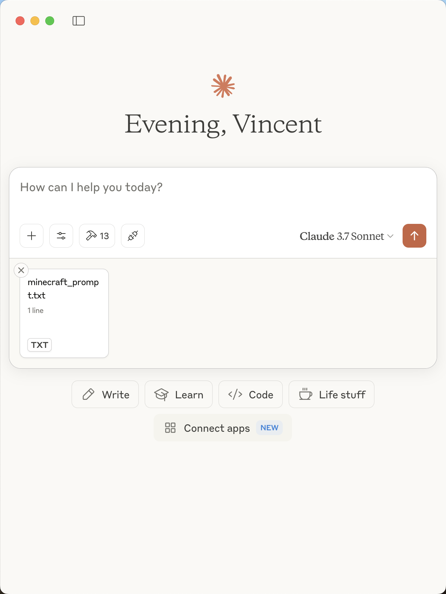

## MoLing MCP Server

English | [汉字](./README_ZH_HANS.md)

[](https://github.com/gojue/moling-minecraft/stargazers)
[](https://github.com/gojue/moling-minecraft/forks)
[](https://github.com/gojue/moling-minecraft/actions/workflows/go-test.yml)
[](https://github.com/gojue/moling-minecraft/releases)

---

https://github.com/user-attachments/assets/1b64d9e5-2cc1-4d9e-8175-9aef425781c8

### Introduction
MoLing-MineCraft is an AI agent MCP server for the Minecraft game, featuring intelligent building, architecture, and game control capabilities. Through natural language interaction, it helps players realize complex constructions, redstone circuit designs, and other creative ideas, enhancing the gaming experience.

### Features

> [!CAUTION]
> Build various structures, railways, redstone circuits, and more. Let large language models expand your thinking, accelerate creativity, and enhance your gaming experience.


### Supported MCP Clients

- [Claude](https://claude.ai/)
- [Cline](https://cline.bot/)
- [Cherry Studio](https://cherry-ai.com/)
- Others (clients supporting the MCP protocol)

### Usage Steps
#### Download Minecraft Java Server
Download the latest Java server from the [Minecraft official website](https://www.minecraft.net/en-us/download/server) and save it locally.

#### Configure Minecraft Client
Using [⛏ Hello Minecraft! Launcher](https://github.com/HMCL-dev/HMCL/releases) as an example, download it, start it first to load the relevant resources, and keep it ready.

#### Configure LLM Client (MCP Client)
Download the corresponding version from [Claude Desktop](https://claude.ai/).

#### Installation
1. Download the package from the [releases page](https://github.com/gojue/moling-minecraft/releases)
2. Extract the package

#### Initialization
Run in command line:
```sh
./moling_mc config --init
```

##### Choose Prompts
click `Attach from MCP` , Choose **MoLing MineCraft AI Assistant**, click `minecraft_prompt`.




#### Assign Tasks

> Build a futuristic Oriental Pearl Radio & TV Tower at locations  "40, 87, 125" ， approximately 100 meters tall. 
> The main structure should be smooth metal and glass, topped with a spherical dome. 
> Add LED lights and luminous stones, and design a modern open plaza at the base of the tower.


#### Witness the Magic
Enter the game and enjoy.

### Instructions
After starting the server, use any supported MCP client to configure and connect to your MoLing server address.

### License
Apache License 2.0. See the [LICENSE](LICENSE) file for details.
