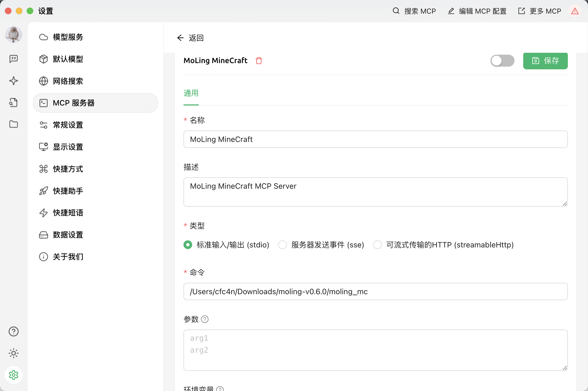
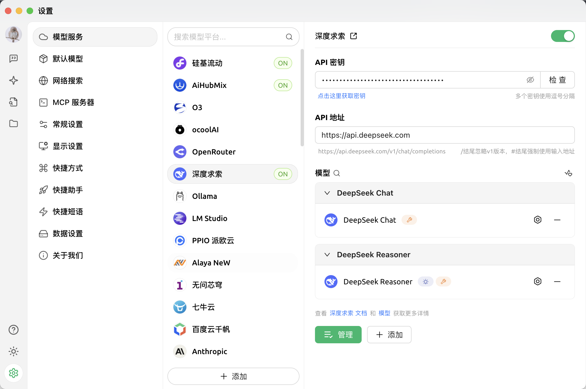

## MoLing MCP Server

English | [汉字](./README_ZH_HANS.md)

[](https://github.com/gojue/moling-minecraft/stargazers)
[](https://github.com/gojue/moling-minecraft/forks)
[](https://github.com/gojue/moling-minecraft/actions/workflows/go-test.yml)
[](https://github.com/gojue/moling-minecraft/releases)

---


### Introduction
MoLing MineCraft is an AI agent MCP server for the Minecraft game, featuring intelligent building, architecture, and game control capabilities. Through natural language interaction, it helps players realize complex constructions, redstone circuit designs, and other creative ideas, enhancing the gaming experience.

### Features

> [!CAUTION]
> Build various structures, railways, redstone circuits, and more. Let large language models expand your thinking, accelerate creativity, and enhance your gaming experience.


### Supported MCP Clients

- [Claude](https://claude.ai/)
- [Cline](https://cline.bot/)
- [Cherry Studio](https://cherry-ai.com/)
- Others (clients supporting the MCP protocol)

### Demo

@TODO

### Usage Steps
#### Download Minecraft Java Server
Download the latest Java server from the [Minecraft official website](https://www.minecraft.net/en-us/download/server) and save it locally.

#### Installation
1. Download the package from the [releases page](https://github.com/gojue/moling-minecraft/releases)
2. Extract the package

#### Initialization
Run in command line:
```sh
./moling_mc config --init
```

#### Configure MoLing MineCraft
Modify the configuration in `~/.moling_mc/config/config.json`
For example:
```json
{
 "Minecraft": {
    "command_timeout": 3,
    "game_version": "1.20.2",
    "javaPath": "java",
    "jvmMemoryArgs": "-Xms1024M -Xmx1024M",
    "password": "",
    "port": 25565,
    "serverJarFile": "minecraft_server.1.20.2.jar",
    "serverLogFile": "minecraft.log",
    "serverRootPath": "/Users/cfc4n/Downloads/minecraft/minecraft_server/",
    "server_address": "localhost",
    "shutdownCommand": "stop",
    "startupTimeout": 5,
    "username": "MoLingMC"
  },
  "MoLingConfig": {
    "Args": "",
    "BaseUrl": "",
    "Command": "",
    "Description": "",
    "HomeDir": "",
    "ServerName": "",
    "SystemInfo": "",
    "Username": "",
    "base_path": "/Users/cfc4n/.moling_mc",
    "config_file": "config/config.json",
    "debug": false,
    "listen_addr": "",
    "module": "all",
    "version": "darwin_arm64_956e4d4_2025-04-20 21:52:18"
  }
}
```
You only need to modify `serverRootPath` and `serverJarFile`, other configurations can remain default.

#### Configure Minecraft Client
Using [⛏ Hello Minecraft! Launcher](https://github.com/HMCL-dev/HMCL/releases) as an example, download it, start it first to load the relevant resources, and keep it ready.

#### Configure LLM Client (MCP Client)
Download the corresponding version from [Cherry Studio](https://github.com/CherryHQ/cherry-studio/releases), open it, and click the settings button in the lower left corner to enter the settings interface.

##### Configure MCP Server
Find the `MCP Server` option, click the `+` button to add a new MCP Server configuration.
- Name: MoLing MineCraft
- Description: MoLing MineCraft AI assistant, natural language interaction, better manage Minecraft server
- Type: Standard Input/Output (Stdio)
- Command: Path to the downloaded `moling_mc`, e.g., `/User/username/Downloads/moling_mc`
- Parameters: _empty_
- Environment Variables: _leave blank_

Save. You should see the available tools list in the `Tools` and `Resources` section, which means it's successful.


##### Configure Model Service
In the configuration page, at the top of the `Model Service`, select the target model and configure it yourself. `Claude Sonnet 3.7` is recommended, followed by [DeepSeek](https://platform.deepseek.com/api_keys)'s `DeepSeek V3`, which requires applying for an API Key.


##### Configure Prompts
**Configure Agent**
1. Open the `four-pointed star` agent button on the left, click `Create Agent`, name it `MoLing Minecraft Agent`, describe it as `MoLing Minecraft Assistant`, use the content from [prompts/minecraft.md](./prompts/minecraft.md) as the prompt, select either the `English` or `汉字` section, paste it, and click `Save`.
2. On the left side of the `MCP Server`, find the `MoLing MineCraft` server added in the previous step, click the button to enable it.
3. Close

**Configure Assistant**
1. Click the dialog box button above the `four-pointed star` to enter the assistant list
2. Click `Add Assistant`, find the agent `MoLing Minecraft Agent` that was just added
3. Select the current assistant to enter the conversation page.

#### Assign Tasks

Make sure the `MCP Server` icon is lit up and ensure that the `model` selected above is correct. Assign tasks in the chat window on the right.


> Build a railway near 3, 80, 19 leading to -240, 80, -40, with redstone circuits on top.

#### Witness the Magic
Enter the game and enjoy.

### Instructions
After starting the server, use any supported MCP client to configure and connect to your MoLing server address.

### License
Apache License 2.0. See the [LICENSE](LICENSE) file for details.
