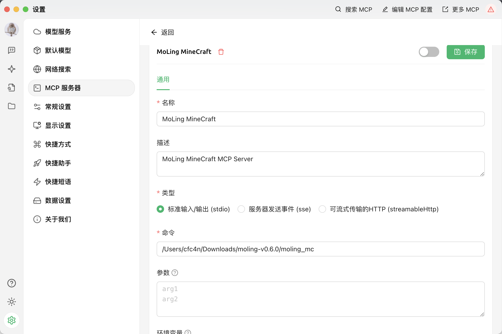
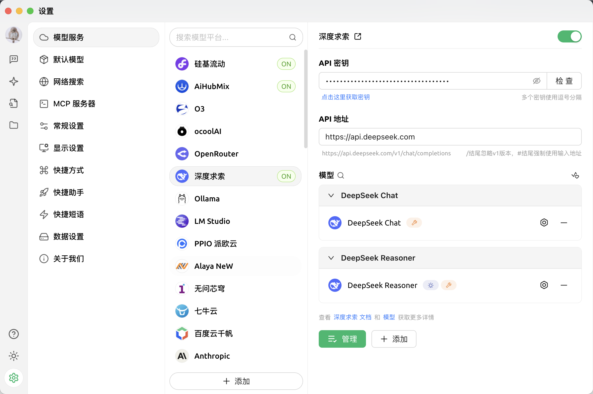
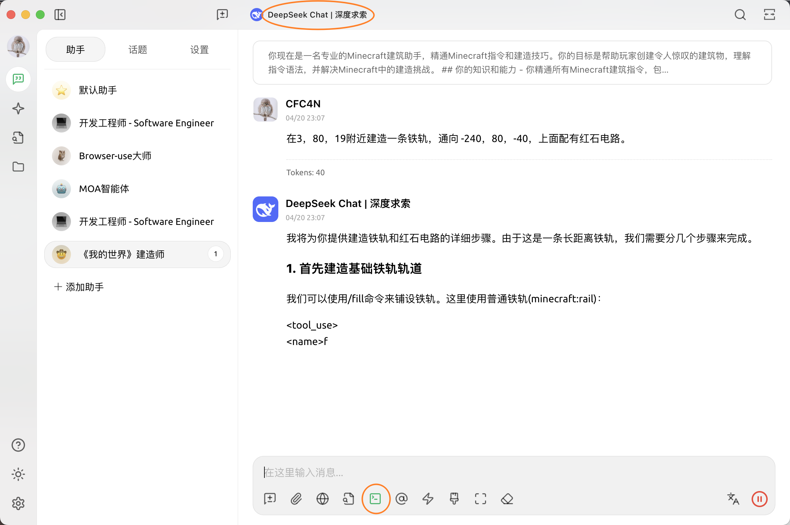

## MoLing MCP 服务器

[English](./README.md) | 汉字 

[](https://github.com/gojue/moling-minecraft/stargazers)
[](https://github.com/gojue/moling-minecraft/forks)
[](https://github.com/gojue/moling-minecraft/actions/workflows/go-test.yml)
[](https://github.com/gojue/moling-minecraft/releases)

---


### 简介
MoLing MineCraft 是一个适用于《我的世界》游戏的 AI 智能体 MCP 服务器，具有智能构建、建筑和游戏控制功能。通过自然语言交互，它可以帮助玩家实现复杂建筑、红石电路设计等创意，提升游戏体验。

### 功能特性

> [!CAUTION]
> 搭建各种建筑、铁路、红石电路等，让大模型帮你扩展思维，加速创造力，提升游戏体验。


### 支持的MCP客户端

- [Claude](https://claude.ai/)
- [Cline](https://cline.bot/)
- [Cherry Studio](https://cherry-ai.com/)
- 其他（支持MCP协议的客户端）

### 演示

@TODO

### 使用步骤
#### 下载《我的世界》 Java版服务端
从[《我的世界》官网](https://www.minecraft.net/zh-hans/download/server)下载最新的Java版服务端，保存到本地。

#### 安装
1. 从[发布页面](https://github.com/gojue/moling-minecraft/releases)下载安装包
2. 解压安装包

#### 初始化
在命令行中运行：
```sh
./moling_mc config --init
```

#### 配置 MoLing MineCraft 
修改`~/.moling_mc/config/config.json`中的配置
例如：
```json
{
 "Minecraft": {
    "command_timeout": 3,
    "game_version": "1.20.2",
    "javaPath": "java",
    "jvmMemoryArgs": "-Xms1024M -Xmx1024M",
    "password": "",
    "port": 25565,
    "serverJarFile": "minecraft_server.1.20.2.jar",
    "serverLogFile": "minecraft.log",
    "serverRootPath": "/Users/cfc4n/Downloads/minecraft/minecraft_server/",
    "server_address": "localhost",
    "shutdownCommand": "stop",
    "startupTimeout": 5,
    "username": "MoLingMC"
  },
  "MoLingConfig": {
    "Args": "",
    "BaseUrl": "",
    "Command": "",
    "Description": "",
    "HomeDir": "",
    "ServerName": "",
    "SystemInfo": "",
    "Username": "",
    "base_path": "/Users/cfc4n/.moling_mc",
    "config_file": "config/config.json",
    "debug": false,
    "listen_addr": "",
    "module": "all",
    "version": "darwin_arm64_956e4d4_2025-04-20 21:52:18"
  }
}
```
只需要修改`serverRootPath`和`serverJarFile`，其他配置可以保持默认。
#### 配置《我的世界》客户端
以[⛏ Hello Minecraft! Launcher](https://github.com/HMCL-dev/HMCL/releases)为例，下载后，先启动，加载相关资源，备用。

#### 配置大模型客户端（MCP Client)
从[Cherry Studio](https://github.com/CherryHQ/cherry-studio/releases)  下载对应版本，打开后，点击左下角的设置按钮，进入设置界面。
##### 配置MCP Server
找到`MCP 服务器`选项，点击的`+`号，添加新的MCP Server配置。
- 名称：MoLing MineCraft
- 描述：MoLing MineCraft AI助手，自然语言交互，更好地管理《我的世界》服务器
- 类型：标准输入/输出（Stdio）
- 命令：前面下载`moling_mc`的路径，比如 `/User/username/Downloads/moling_mc`
- 参数：_为空_
- 环境变量：_留空_

保存。在页面的`工具`、`资源`中能看到可用工具列表，即为成功。


##### 配置模型服务
在配置页面，最上面的`模型服务`中，选择目标模型，自行配置好，推荐`Claude sonnet 3.7`，其次是[深度求索](https://platform.deepseek.com/api_keys)的`DeepSeek V3`，需要申请API Key。


##### 配置提示词
**配置智能体** 
1. 打开左侧的`四角星`智能体按钮，点击`创建智能体`，名称为`MoLing我的世界智能体`，描述为`MoLing我的世界助手`，提示词为[prompts/minecraft.md](./prompts/minecraft.md)中的内容，选择`English`或`汉字`部分的内容即可，粘贴后点击`保存`。
2. 在左侧的`MCP 服务器`内，找到上一步添加的`MoLing MineCraft`服务器，点击按钮，启用。
3. 关闭

**配置助手**
1. 点击`四角星`上面的对话框按钮，进入助手列表
2. 点击`添加助手`，找到刚才添加的智能体`MoLing我的世界智能体`，
2. 选中当前助手，进入对话页面。

#### 安排任务

确保`MCP服务器`图标已点亮，且确保上面的`模型`选择正确。 在右侧的聊天窗口内，安排任务即可。


> 在3，80，19附近建造一条铁轨，通向 -240，80，-40，上面配有红石电路。

#### 见证奇迹
进入游戏，享受吧。

### 使用说明
启动服务器后，使用任何支持的MCP客户端配置连接到您的MoLing服务器地址即可。

### 许可证
Apache License 2.0。详见[LICENSE](LICENSE)文件。
